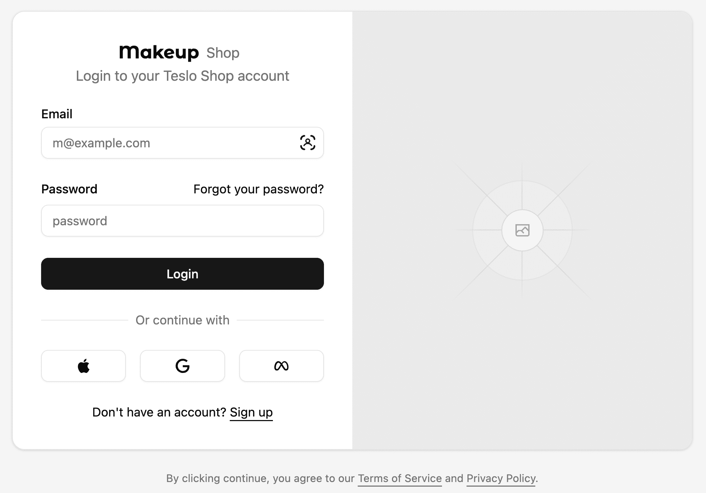
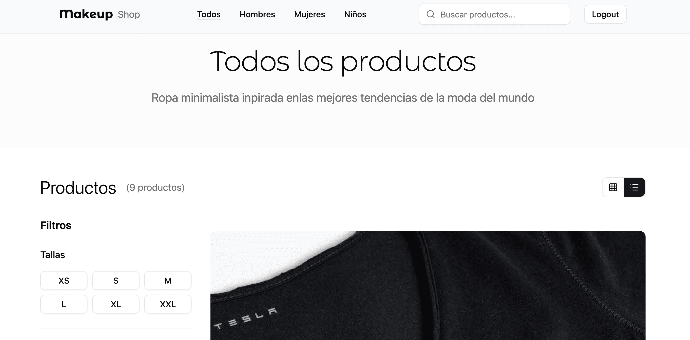

# Makeup Shop

Ecommerce interface project

## 🚀 Steps to Get Started

Follow these steps to set up the project locally and start the development server.

1.  **Clone the Repository:**
    ```bash
    git clone https://github.com/freddyarh/shop.git
    ```

2.  **Install Dependencies:**
    Navigate to the root of the project directory in your terminal and run the following command to install all necessary packages:
    ```bash
    npm install
    ```

3.  **Run the Project:**
    Start the development server (often accessible at `http://localhost:3000` or a similar port):
    ```bash
    npm run dev
    ```

## Some Screens

### Login Screen



### Home Screen

